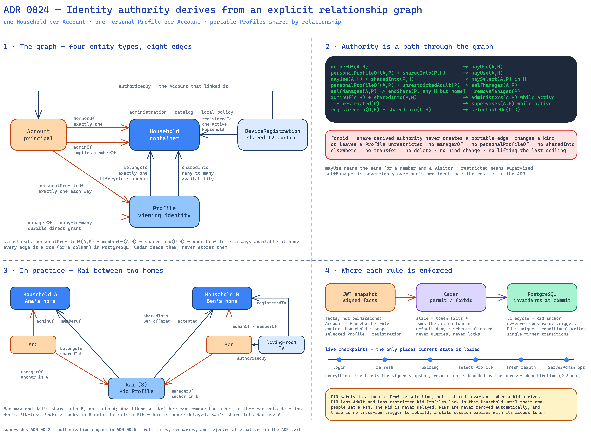

= ADR 0024: Identity Authority: One Household per Account, One Personal Profile per Account, Portable Profiles Facilitate Sharing by Relationship

== Status

Accepted

Supersedes link:0022-single-home-accounts-and-portable-profile-sharing.adoc[ADR 0022] and link:0021-device-pairing-over-streamarr-transport.adoc[ADR 0021]'s binding of a paired device to the approving Account's home Household.
The authorization engine behind this model is a separate decision, made in link:0025-cedar-decides-authorization.adoc[ADR 0025]; this ADR stands whichever engine is chosen.

== Context

link:0022-single-home-accounts-and-portable-profile-sharing.adoc[ADR 0022] gave every Account one home Household, made Profiles portable through named managers and Household shares, and made child safety a rule the server enforces rather than the client.
Those decisions hold; how child safety is enforced changes below.
Implementing it (streamarr-server PR #296, about 22,000 added lines and a 792-line migration) showed that the relationships around them were incomplete or wrong.

* An Account had no Profile of its own.
  Every Account was merely a manager of Profiles it happened to create, so "this Profile is me" — the case of a child who later gets a login, or an adult whose identity should follow their Account — had no representation.
* A Profile had no canonical Household.
  Household teardown, the local manager a Kid Profile needs, and "which deletion deletes this Profile" therefore had nowhere to anchor.
* Sharing a Profile into a Household let that Household's members use the Profile, but never let the Profile's own person use that Household.
  A visitor could appear on a friend's TV yet could not browse the friend's catalog from their own devices, and a parent who moved out could not act on their own Profile left behind.
* One `OWNER` per Household with `PARENT` delegates encoded a hierarchy the product does not need once ServerAdmin resolves disputes; it cost a unique index and two constraint triggers.
* Because an Account has one Household, ADR 0022 refused to bind a television to a Household.
  Once an Account may use more than one Household, a shared TV needs one fixed context again.
* Authority was re-derived in each service by hand, with nothing checking that the predicates agreed, covered every action, or honored the guardrails.
  That is decided separately in link:0025-cedar-decides-authorization.adoc[ADR 0025].

This ADR restates the identity model as an explicit relationship graph and derives every authority from it.
It defines identity, authorization relationships, transfer and deletion rules, and safety invariants.
GraphQL design, screens, notifications, and final error copy are deferred.
Streamarr still has no production instances, so adoption resets development and test databases rather than migrating family rows.

== Diagram

link:diagrams/0024-identity-relationship-graph.excalidraw[Editable Excalidraw source]

== Decision

=== Core model

An Account authenticates and initiates requests.
A selected Profile supplies viewing context and receives viewing activity.
Authorization considers both, but a Profile cannot authenticate or exercise administrative authority by itself.

A Profile can still “act” in domain language: it watches content, accumulates history, changes viewing preferences, and is selected for playback.
Technically, an Account performs the request using that Profile.

----
Account request + selected Profile -> activity recorded against Profile
----

==== Relationships

[options="header"]
|===
| Relationship | Meaning | Cardinality

| `+Account --memberOf--> Household+` | The Account's Household membership | Exactly one per Account
| `+Account --adminOf--> Household+` | HouseholdAdmin authority | Implies `memberOf`
| `+Account --personalProfileOf--> Profile+` | The Profile represents that Account | Exactly one per Account; at most one Account per Profile
| `+Account --managerOf--> Profile+` | Durable direct ProfileManager authority | Many-to-many
| `+Profile --belongsTo--> Household+` | The Profile's canonical Household | Exactly one per Profile
| `+Profile --sharedInto--> Household+` | Makes the Profile available there | Many-to-many
| `+DeviceRegistration --registeredTo--> Household+` | Fixes a shared Device's Household context | One Household per registration; an ESN may have several
| `+DeviceRegistration --authorizedBy--> Account+` | Records who linked the Device | Exactly one Account per active registration
|===

These are graph edges even when PostgreSQL stores one as entity columns.
The current `home_household_id` and `household_role`, for example, encode `memberOf` and `adminOf`.

One share is structural — required by two other edges rather than chosen:

----
personalProfileOf(Account, Profile) + memberOf(Account, Household)
    -> sharedInto(Profile, Household) must exist
----

An Account's Personal Profile is always available in the Account's own Household.
That share is an ordinary stored share row like any other, but it is created with the Account and cannot be ended while the Account remains a member.
When the Account transfers, the share into the destination is created in the same transaction; the share into the previous Household ends unless the transfer keeps it as an ordinary visitor share (see Account transfer).

Derived authority:

----
memberOf(Account, Household)
    -> Account may use Household

personalProfileOf(Account, Profile) + sharedInto(Profile, Household)
    -> Account may use Household

Account may use Household + sharedInto(Profile, Household)
    -> Account may select Profile there

personalProfileOf(Account, Profile) + unrestrictedAdult(Profile)
    -> Account is a derived ProfileManager of its own Profile (self-management)

self-management(Account, Profile)
    -> Account may end any share of Profile except the one into its own Household
    -> Account may remove any direct ProfileManager of Profile

adminOf(Account, Household) + pendingOffer(Profile, Household)
    -> Account may accept or reject that offer

adminOf(Account, Household) + sharedInto(Profile, Household)
    -> Account may administer Profile there while the share is active
       (see details, remove)

adminOf(Account, Household) + sharedInto(Profile, Household) + restricted(Profile)
    -> Account supervises Profile while the share is active
       (edit name, picture, ceiling, PIN — never its kind, never leaving it unrestricted)

registeredTo(Device, Household) + sharedInto(Profile, Household)
    -> Profile may be selected on Device
----

"May use a Household" means the same viewing access a member has: select any Profile available there and browse its catalog.
It grants no membership, Household role, or administrative visibility.
Web Household switching and Device linking both rest on this one relationship, so they always agree about who may see what.

=== Account, Profile, and Household rules

==== Account

An Account is the login and security principal.
It has an email, password, administrative display name, enabled status, one Household membership and role, optional ServerAdmin authority, and exactly one Personal Profile.
A Profile never has login credentials or an independent session.

Account creation atomically establishes `memberOf`, `personalProfileOf`, the Profile's `belongsTo`, and availability in that Household.
An Account is never committed without them.

Transferring an Account also transfers its Personal Profile: the Account joins the destination, the Profile's `belongsTo` relationship moves there, the Profile becomes available there, and every Account session returns to the Profile picker so a Profile must be selected again.
The Profile retains its identity, history, progress, preferences, PIN, policy, managers, and its shares into other Households.
The transfer names what happens to the source Household:

----
sourceAccess: END | KEEP_AS_VISITOR
----

`END` is the default: the Profile's share into the previous Household ends, and with it the Account's access there, its Device registrations there, and its refreshable sessions there.
`KEEP_AS_VISITOR` keeps that share as an ordinary one, so the person keeps Household access, Profile availability, and linked Devices there as a visitor, and may end it later like any share of their own.
The old share was created automatically by membership; silently turning it into permanent visitor access would surprise the Household, so removal is the safe default and the confirmation spells out what `KEEP_AS_VISITOR` preserves — and, when the Profile is restricted, that the previous Household's admins keep supervising it while that share lasts.
The transfer is one atomic operation either way; issued access tokens still expire within the configured lifetime.
Devices never move with the Account.
The destination must satisfy name uniqueness and local-manager rules; PIN locks in the destination are re-evaluated, never a reason to refuse.

An Account has no detached membership state.
ServerAdmin may transfer it, delete it, or temporarily disable it.
Disabling revokes the Account's refresh sessions and the Device registrations it authorized, and blocks login, refresh, pairing, and reauthentication; issued access tokens expire within the configured short lifetime.
Disabling does not remove membership, roles, or manager grants, and it is never rejected by a Household rule — the only rule that gates disabling is that one enabled ServerAdmin must remain.
ServerAdmin may issue a single-use password-reset code for any Account; redeeming it is allowed while disabled, and it never reveals the old secret.
A code expires after a bounded configured time, at most one code per Account is current and issuing a new one invalidates the old, redemption is throttled like the password checkpoint, a successful reset revokes every refresh session of the Account so the person signs in fresh everywhere, and an outstanding code is invalidated when the ServerAdmin who issued it loses ServerAdmin authority or is disabled.
Delivery is deferred like invitation delivery.

Every Household containing Accounts must retain an Account holding the HouseholdAdmin role.
A transfer, deletion, or demotion that would violate this rule is rejected.
Any required replacement HouseholdAdmin is assigned first through a separate operation; the original operation then rechecks the rule.
A Household whose HouseholdAdmins are all disabled keeps working for its members and surfaces to ServerAdmin as needing an active admin.

The final Account cannot be transferred or deleted independently.
It is handled only by Household teardown, which also deletes the source Household.

===== Account deletion

An Account and its Personal Profile are a pair.
The Account can never sever that link on its own; the only self-service way out is to delete both together.

An enabled Account whose Personal Profile is unrestricted Adult may delete itself and its Personal Profile in one atomic destructive action after fresh password reauthentication.
Self-deletion is rejected while the Account is the last HouseholdAdmin of its Household, the last Account of its Household, or the last enabled ServerAdmin, and while removing it would leave any Profile it manages without a manager or home anchor; the replacement is arranged first and the deletion rechecks.
Because such an Account is sovereign over its own Profile, it may first remove any direct ProfileManagers, so no co-manager veto applies.
The deletion itself ends the Profile's shares, cancels its pending offers and manager invitations, revokes the Account's Device registrations and sessions, and erases the pair in one transaction — the same cascade as ServerAdmin's force-delete, without the override.
A restricted Account cannot self-delete; only ServerAdmin's combined deletion below can erase the pair, typically at its supervisors' request.

ServerAdmin may permanently delete any Account.
The operation explicitly chooses:

* *Keep the Profile:* remove the Account and Personal Profile link while preserving the Profile and its data.
  Before deletion, establish an eligible direct ProfileManager in the Household the Profile belongs to if it would otherwise lose its final manager or local management anchor.
* *Delete Account and Profile:* atomically erase the Account–Personal Profile pair and the Profile's private data and relationships through the force-delete path, unlinking inside the same transaction.

Keeping the Profile is the safe default.
Invitations, manager grants, and HouseholdAdmin role changes are completed separately, then deletion rechecks every precondition.
Deletion also rejects if removing the Account would leave any other managed Profile without a manager or home anchor.

==== Profile

A Profile is a portable viewing identity containing its name, picture, PIN, `KID` or `ADULT` kind, optional Content Ceiling, viewing history and progress, and preferences.

Kid and Adult Profiles may exist without Accounts.
Kind, Content Ceiling, and Account linkage are independent: linking a Kid Profile does not make it Adult or remove restrictions.

A restriction means supervision.
An Adult never restricts themselves: a Content Ceiling on an Adult Profile means another ProfileManager supervises it, and a supervised Profile does not self-manage.
"Restricted" throughout this document means Kid kind or any Content Ceiling; "unrestricted Adult" means Adult kind with no ceiling.

Every Profile belongs to exactly one Household:

----
Profile --belongsTo--> Household
----

This relationship determines teardown and where the Profile's _home anchor_ — its local management anchor — must exist.
It does not make the Profile available, grant authority, or mean that a person owns it.
Sharing does not change it.

The home anchor is:

* For an unrestricted Adult Personal Profile, its Account in the same Household.
  Management is derived; no duplicate `managerOf` edge is stored.
* Otherwise, an eligible direct ProfileManager who is a member of that Household.
* For a Kid or content-restricted Profile, an Account holding the HouseholdAdmin role in that Household whose Personal Profile is unrestricted Adult, recorded as a direct ProfileManager.

While a restricted Profile is shared into another Household, that Household's eligible HouseholdAdmins supervise it for the duration of the share; that is derived authority, not an anchor, and it ends with the share.
Account transfer or deletion, Profile transfer, manager removal, HouseholdAdmin demotion, restriction of a Personal Profile, and Household teardown recheck the home anchor.
Disabling an Account does not: the anchor is a structural relationship, and a disabled anchor surfaces as needing attention rather than blocking the disable.
An unlinked Profile may transfer only through a ServerAdmin operation that establishes the destination anchor before commit.
A linked Personal Profile moves only with its Account.

Transfer preserves the Profile and its data, managers, Account link when present, and other shares.
It changes `belongsTo`, ensures availability in the destination, and rechecks the destination's name-uniqueness and anchor rules; PIN locks there are re-evaluated.

Deleting the Household a Profile belongs to deletes that Profile unless ServerAdmin first transfers it.
Deleting a Household that merely receives the Profile ends that share without deleting the Profile.
A HouseholdAdmin may also remove an unlinked Profile that belongs to their Household; it then belongs there without being available, keeps its home anchor, and returns only through a new offer or a ServerAdmin transfer.

==== Household

A Household is a private administration, catalog, and local-policy boundary.
Household administration and Household switching exist only in Streamarr-web, and device-bound sessions are forbidden them by authorization, not merely by the client (see Device linking).
An Account selects its current Household from the Profile menu among Households it may use.
A shared TV never shows this selector because Device registration fixes its Household.

A ServerAdmin may create an empty Household.
Its first Account automatically becomes HouseholdAdmin; later Accounts default to HouseholdMember.
Once that first Account is added, the Household must always retain at least one Account and one Account holding the HouseholdAdmin role until teardown deletes the Household.

No Profile may belong to a newly created empty Household because no local Account can satisfy the management anchor.

An Account may use another Household when its Personal Profile is actively shared there.
Using a Household is the same viewing access a member has — select any Profile available there, browse its catalog, link a Device to it — without membership, a Household role, or administrative visibility.
Accepting a share of someone's Personal Profile therefore admits that person to the Household.
This is a deliberate policy choice, not a technical limit: inviting someone into your home gives them the run of the living room.
Three things keep it honest: the share-acceptance confirmation says so in plain words; HouseholdAdmins see and may revoke that person's Device registrations; and ending the share revokes their Device registrations there and drops their web sessions back to their own Household.

HouseholdAdmins are peers.
There is no HouseholdOwner, `OWNER`, or `PARENT` role:

----
HouseholdAdmin implies HouseholdMember
----

=== Authority

==== ServerAdmin

ServerAdmin is global superuser authority, not Household membership.
It may inspect all application-domain data and perform every defined operation through ordinary or explicit override paths.
An explicit override is a distinct action and application use case; its authority, fresh-reauthentication, reason, and audit requirements never widen the corresponding ordinary path.
It does not place every Profile in the Account's ordinary picker and never reveals authentication secrets.

Initial setup is the only bootstrap exception to ServerAdmin-only creation.
One transaction creates the first Household, Account, and Personal Profile; makes the Profile belong to and available in the Household; and grants the Account both ServerAdmin and HouseholdAdmin.
No partial setup state is visible.

After setup, only an enabled ServerAdmin may change ServerAdmin authority.
At least one enabled ServerAdmin must remain; nobody sits above ServerAdmin to re-enable one, so this is the one rule that gates disabling an Account as well as removing it.

A ServerAdmin may:

* Create and permanently tear down Households.
* Invite, create, transfer, disable, re-enable, and delete Accounts.
* Appoint or remove HouseholdAdmins while preserving Household invariants.
* Transfer an unlinked Profile; a linked Personal Profile moves with its Account.
* Force-unshare or force-delete an unlinked Profile, or erase a linked pair through Account-and-Profile deletion.
* Inspect, revoke, or block Devices.
* Override disputed or unusable ProfileManager relationships.

ServerAdmin does not bypass structural database invariants.
Recovery handles unavailable people or disputed relationships, not preventable invalid data.
Destructive and break-glass operations — Account deletion, Profile force-delete and force-unshare, manager override, Household teardown, ServerAdmin authority changes, server-wide ESN blocks, restricting a sovereign Adult Profile, leaving any Profile unrestricted, setting or resetting another person's Profile PIN by override, and issuing an Account password-reset code — are the ServerAdmin members of the fresh-reauthentication action group defined under Authorization architecture: each requires fresh password reauthentication by an enabled ServerAdmin and audits the actor, resources, reason, and time, because these are exactly the operations a stolen ServerAdmin session must not be enough for.
Transfer, disable, re-enable, and role changes need live ServerAdmin authority and an audit record, not reauthentication.

Every ServerAdmin operation checks live ServerAdmin authority rather than relying on a stale access-token claim; the authorization slice loads it from PostgreSQL as a current principal fact for those actions (link:0025-cedar-decides-authorization.adoc[ADR 0025]).

Only ServerAdmin may read the security audit log.
No role, including ServerAdmin, may read password or PIN hashes, access or refresh tokens, session secrets, invitation codes, or other reusable authentication material.

===== Household teardown

ServerAdmin may tear down a Household, including through an audited break-glass path.
The operation revokes its Device registrations and refresh sessions, and the registrations its Accounts authorized anywhere, returns affected sessions to the Profile picker, cancels pending invitations and offers, ends shares, deletes its Accounts, deletes Profiles that belong to it, and then deletes the Household.

Before teardown, ServerAdmin transfers out whatever should survive through the ordinary workflows: every Account but the last, and every unlinked Profile worth keeping.
Teardown then handles the final Account atomically with deleting the Household: transfer the Account with its Personal Profile, delete both, or delete the Account while transferring its preserved Profile.
Whatever still belongs to the Household is deleted; Profiles that merely visit are only unshared.
Because a Profile's home anchor always lives in the Household it belongs to, deleting this Household's Accounts cannot strand a Profile that belongs elsewhere — it can only remove a co-manager, and the share into this Household ends with it.

==== HouseholdAdmin

A HouseholdAdmin may:

* Edit Household settings.
* Inspect, revoke, or block its Devices.
* Inspect administrative details of its Accounts and available Profiles.
* Create Profiles in the Household.
* Accept or reject offers of Profiles into the Household — authority over the pending offer, held through `adminOf` the target Household.
* Administer a Profile while it is shared into the Household: see its administrative details as scoped under Read authorization, and remove it from the Household — except a member's own Personal Profile, which leaves only with its Account.
* Supervise a _restricted_ Profile while it is shared into the Household: edit its name, picture, Content Ceiling, and PIN, with the edits applying everywhere the Profile goes.
  A restriction means supervision, and while a supervised Profile is in your home, you are one of its supervisors.
  Share-derived supervision may tighten, adjust, or set; it may never change the Profile's kind, and never leave the Profile unrestricted.
  Lifting the final restriction means the _resulting_ Profile would be Adult with no Content Ceiling — that ends supervision itself — and only a named ProfileManager or a live ServerAdmin override may do that; kind is reserved to managers as well, because a Kid's presence is what triggers PIN protection in every home it visits.
  The authorization module, not the caller, decides which of these an update is: it takes the typed update, computes the resulting kind and ceiling from current state, authorizes that exact transition, and the mutation writes those same values in the same transaction.
  An unrestricted Adult Profile is edited only by its ProfileManagers — itself, when it is someone's Personal Profile.
  Ana cannot rename visiting Sam or reset his PIN; Rose can set visiting Kai's PIN and adjust his ceiling.
  This document says _administer_ and _supervise_ for this share-scoped, Household-derived authority and _manage_ for ProfileManager authority, which is durable and portable.

Household-derived Profile authority ends with the share.
Acting only through that authority, an admin cannot edit an unrestricted Adult Profile, change a restricted Profile's kind or leave it unrestricted, offer any Profile elsewhere, create a Personal Profile link, add a direct ProfileManager, transfer it, or permanently delete it.
An admin who wants durable authority over a Profile becomes its manager the ordinary way — by creating it, by accepting a manager invitation, or by ServerAdmin grant.

HouseholdAdmins cannot manage Accounts or HouseholdAdmin relationships, invite Accounts to the server, or delete the Household.
They contact ServerAdmin outside Streamarr for those operations; there is no formal request workflow.

==== HouseholdMember

A HouseholdMember may select available Profiles, enter required PINs, watch under the selected Profile's restrictions, manage their own Account credentials and details, and manage their unrestricted Adult Personal Profile through derived ProfileManager authority.
Membership alone grants no Profile-administration authority.

==== ProfileManager

ProfileManager authority comes from either:

----
personalProfileOf(Account, unrestricted Adult Profile)  derived
managerOf(Account, Profile)                              direct
----

A ProfileManager may edit the Profile and its policy, manage its PIN, offer it to a Household, invite another direct manager, inspect its activity, and participate in permanent deletion.
One exception follows from "a restriction means supervision": a self-managing Account may not set a Content Ceiling or Kid kind on its own Profile, and neither may a retained direct manager; restricting a sovereign adult is a ServerAdmin override under Administrative eligibility.
Supervision is wider than management: while a restricted Profile is shared into a Household, that Household's eligible admins may edit it too, but only a manager (or ServerAdmin override) may change its kind or leave it unrestricted, and only a manager's authority survives the share.
Leaving a Profile unrestricted ends its supervision and may start its self-management, so whoever does it — manager or ServerAdmin — re-enters their password first; a stolen access token must not be enough to remove a child's protections.
Management does not make the Profile available.

Derived authority lasts while the Personal Profile is linked and unrestricted.
A direct grant lasts until relinquished, removed by the sovereign Account described below, overridden by ServerAdmin, or its Account is deleted, and survives unsharing.

Any one ProfileManager may invite another; co-manager approval is not required.
The recipient must accept.
A direct manager may relinquish their own grant but cannot remove a peer.
ServerAdmin may grant or override directly.

Peer management was designed for two adults over a Profile that is not their own.
A person's own identity is different: an Account with self-management is sovereign over its Personal Profile and may remove any direct ProfileManager of it, end any share of it except the one into its own Household, and delete it together with the Account.
Direct grants on an unrestricted Adult Personal Profile therefore exist at that Account's pleasure and carry no deletion veto.
When a supervised Personal Profile becomes unrestricted Adult — a teenager turning eighteen — self-management begins and the existing direct grants remain until that Account removes them.

Every Profile retains at least one derived or direct ProfileManager and the local anchor defined above.

==== Administrative eligibility

An Account whose Personal Profile is restricted is a supervised person and cannot be HouseholdAdmin, a direct ProfileManager, or ServerAdmin; otherwise it could lift its own supervision.
It must first become unrestricted Adult.
"Eligible" throughout this document means exactly this: an Account whose Personal Profile is unrestricted Adult.

Conversely, an unrestricted Adult Personal Profile is not restricted by a direct manager at all: a retained manager could otherwise strip a sovereign adult of self-management with one ceiling and could then no longer be removed.
Only a ServerAdmin override restricts an unrestricted Adult Personal Profile, and only after its Account's HouseholdAdmin, ProfileManager, and ServerAdmin roles are removed and another manager exists, because derived self-management will end; a consent-based path may relax this later.
An unlinked unrestricted Adult Profile may still be restricted by any of its managers.

A restricted Account cannot be the first Account in an empty Household because that Account must become HouseholdAdmin.

=== Profile safety and policy

==== Restricted Profile supervision

A restricted Profile — Kid or ceilinged — needs two things: a home anchor — a named, eligible HouseholdAdmin manager in the Household it belongs to — and, in every Household it visits, an eligible HouseholdAdmin who supervises it while it is there.
The second is a fact about the target Household, not about who clicks accept: a share of a restricted Profile activates only into a Household that already holds an eligible HouseholdAdmin, whether the accepting party is that admin or ServerAdmin, and an operation that would remove a hosting Household's last eligible admin — demotion, transfer, deletion, restriction — is rejected while such a share is active.
Acceptance — by an eligible admin, or by ServerAdmin on that Household's behalf, which still requires an eligible admin to exist there — is the local consent; the share is the supervision; PostgreSQL holds the invariant.
No durable ProfileManager grant is required merely to host a restricted Profile; a Household that should keep authority after the visits end gets it the deliberate way, through a ProfileManager invitation or a ServerAdmin grant.
Reclassifying an available Adult Profile as Kid, or restricting an Adult one, rechecks its home anchor, every hosting Household's eligible admin, and the locks in every Household where it is available.

==== PIN safety

When a Household has any Kid Profile, every Adult Profile and every less-restricted Kid Profile available there needs an effective PIN — a server-verified PIN set on the Profile.
A Profile that lacks one is _locked_ in that Household: it still appears in the picker, but it cannot be selected there until a PIN is set.
Creating, transferring, or sharing in a Kid is never blocked by other people's missing PINs — with ten Profiles in a home, a Kid should not wait on ten people.
The Kid is protected the moment it arrives, and each locked Profile is fixed by its own people:

* An unrestricted Adult Personal Profile is unlocked by its own Account, which sets a PIN at its next login and continues — or by any direct manager it has kept.
* A Profile with no Account, or a supervised one, is unlocked by any of its ProfileManagers.
* The preflight for the Kid change lists every Profile that will lock, so the person making the change can warn them; it does not stop the change.

Locking is per Household because the requirement is: a Profile locked where a Kid is present stays selectable where none is.
Locking writes nothing to the Profile; it is evaluated at selection from the Household's current share set.

Restrictiveness is deterministic:

* Unrestricted is less restrictive than restricted.
* A higher maximum rating age is less restrictive than a lower one.
* Adult always requires a PIN when any Kid Profile is present.
* An Adult's restriction does not create this boundary; a Kid Profile does.

A Kid Profile needs a PIN only when it is less restrictive than another Kid Profile in a Household where both are available.
Because a PIN is portable, setting or changing it affects every Household.
Streamarr never removes a PIN on its own: when the last Kid leaves a Household, PINs there simply stop being required, and their owners may keep or remove them.
Removing a PIN is refused while it would lock the Profile in any Household where it is available; the error names the Household, and the Kid only when the caller may already see that Kid's picker summary — otherwise it says the PIN is required by that Household's safety policy.

Any Profile kind, Content Ceiling, PIN, creation, transfer, or share change changes which Profiles are locked in every affected Household; nothing is stored, the preflight simply evaluates the same rule selection will.

Restricted Accounts cannot weaken safety through self-service.
The authorization engine decides whether the actor may attempt a change and refuses to select a locked Profile; application services compute useful preflight errors.
Because selecting a Profile is already a live checkpoint that verifies the current share and PIN, the lock needs no stored state and no cross-row database constraint; a Profile selected before a Kid arrived keeps its session only until its access token expires and refresh re-evaluates the lock.
`POST /api/auth/select-profile` owns that whole flow — authenticate the Account and live session, confirm the Profile is available in the context Household, decide whether a PIN is required, throttle and verify it, apply the lock, record the selection, and issue the Profile-scoped token — and the verified-PIN result (`pinVerified`) exists only as trusted internal attempt context inside that ceremony; there is no PIN proof type and no client-supplied `pinVerified` flag anywhere else.
The home anchor and the lifecycle rules remain database invariants.

==== Portable and local policy

Profile kind, Content Ceiling, PIN, preferences, history, and progress are portable.
Household catalog, rating region, and local safety state are local.
Playback requires both policies to allow it; neither can weaken the other's denial.

=== Workflows

==== Profile creation and Personal Profiles

ServerAdmin may create a Profile for a Household; a HouseholdAdmin may create one in their Household.
Creation atomically establishes the Profile, its `belongsTo` relationship, availability there, and management:

* An independent Profile's eligible creator becomes its first direct ProfileManager.
  A ServerAdmin creator who is also a local member satisfying the home-anchor rule for that Profile kind anchors it alone.
  A remote ServerAdmin remains a direct ProfileManager, but creation also names and grants an eligible local manager.
* An unrestricted Adult Personal Profile derives self-management from its Account.
* A Kid or restricted Profile's local manager must additionally hold the HouseholdAdmin role and have an unrestricted Adult Personal Profile.

Every Account has exactly one Personal Profile, and a Profile represents at most one Account.
An existing Account cannot later claim another Profile.
Instead, while creating a new Account, ServerAdmin may connect an existing unlinked Profile through the Account invitation.
The invitation's Household must be the Household that Profile belongs to; if the person should live elsewhere, ServerAdmin transfers the Profile first, through the ordinary transfer with its anchor check.

Acceptance atomically creates the Account, links its Personal Profile, makes both relate to the same Household, and makes the Profile available there.
History, progress, preferences, PIN, policy, and managers remain.
Shares into other Households do not: a Profile's share admitted a Profile, and once it is someone's Personal Profile the same share would admit the person — their Household switching and Device linking — which those hosts never consented to.
Connecting therefore ends every share except the home one and invalidates every pending offer of the Profile, so no offer made under the old terms can be accepted after the Profile becomes a person's.
Hosts are then offered the Profile afresh, told what accepting means: the Account invitation may name the Households to re-offer automatically the moment the invitation is accepted, or the fresh offers are sent later as ordinary operations; the invitation preflight lists which Households are affected.
The Account–Personal Profile pair thereafter transfers together.
An Account whose Personal Profile is unrestricted Adult gains derived management; a restricted Personal Profile requires the eligible local direct manager.

==== Invitations

Streamarr has three distinct proposals:

[options="header"]
|===
| Type | Created by | Accepted by | Result

| Account invitation | ServerAdmin | Named recipient | Account, Household membership and role, and exactly one Personal Profile
| ProfileManager invitation | Any ProfileManager | Named Account | Direct durable `managerOf` grant
| Profile share offer | ServerAdmin or ProfileManager | ServerAdmin or target HouseholdAdmin | Active `sharedInto` relationship
|===

An Account invitation specifies recipient, Household role, Profile kind and ceiling, whether to create or connect a Profile, and the required local manager for a restricted Profile.
The role is forced to HouseholdAdmin for the first Account of an empty Household, and a restricted Profile cannot be invited there.
An existing email cannot be invited or reassigned; ServerAdmin uses Account transfer instead.

Account and manager invitations use:

----
PENDING -> ACCEPTED | DECLINED | CANCELED | EXPIRED | INVALIDATED
----

Only the named recipient accepts or declines.
Acceptance atomically resolves the invitation and creates its relationship.
Each code is single-use and expires after a bounded configured time.
Only ServerAdmin may create, replace, cancel, or invalidate Account invitations; an inviting ProfileManager may cancel their pending manager invitation, and ServerAdmin may invalidate it.

Invitation records are retained.
Under the current KISS policy, only the newest invitation for the same target may remain pending; replacement atomically invalidates the older one.
The target is recipient email for Account invitations and Account-plus-Profile for manager invitations.

A direct ServerAdmin manager grant invalidates a pending invitation for the same Account and Profile.
ServerAdmin removal also invalidates older pending invitations so an old code cannot restore disputed authority.
A pending invitation or offer is also invalidated when its Profile is deleted, transferred, or connected to an Account, its named Account is deleted or becomes ineligible, its inviting or offering manager loses management, its creating ServerAdmin loses ServerAdmin authority or is disabled, or its target Household is torn down; the system is the acting party.
A removed or compromised ServerAdmin therefore leaves no codes behind that could take effect later.
Acceptance rechecks every eligibility and safety rule as of that moment.
The sovereign Account may cancel any pending offer of its own Personal Profile.

==== Profile sharing

A share makes one Profile available to a Household without copying data.
It grants derived authority to that Household's admins while active, but does not create membership, a Personal Profile link, or a direct manager.

Share offers use:

----
PENDING -> ACTIVE -> ENDED
    |------> REJECTED | CANCELED | EXPIRED | INVALIDATED
----

* ServerAdmin or ProfileManager may offer.
  A self-managed Personal Profile is offered only by its own Account (or ServerAdmin), because acceptance admits that person to a Household; a supervised Personal Profile may be offered by its managers, which is what supervision means.
* ServerAdmin or a target HouseholdAdmin may accept or reject.
* The offerer may cancel while pending; the system invalidates a pending offer when its Profile, Household, or offering manager can no longer carry it, as listed under Invitations.
* Only active shares affect availability and safety.
* The structural share of a Personal Profile into its Account's own Household cannot reach `ENDED` while that membership holds; the authorization guardrail forbids the action and the database rejects the transition.
* At most one offer per Profile and Household is pending; a new offer replaces and cancels the older one.
* Every transition conditionally checks its expected state; concurrent terminal actions have exactly one winner and one audit record.

An active share may be ended by ServerAdmin, a HouseholdAdmin of that Household, a ProfileManager whose Account is a member there, or — from any Household except its own — the Account whose self-managed Personal Profile it is.
Nobody may end the structural share of a Personal Profile into its Account's own Household; a Household that wants a member gone asks ServerAdmin to transfer or delete the Account.
A self-managed person may always withdraw their own identity from a home they were visiting, or from a home they have moved out of.
A remote manager of any other Profile cannot unshare it from another Household: Dad cannot take Kai out of Mom's house.

Unsharing returns affected sessions using that Profile to the Profile picker but preserves the Profile and its data, policy, and direct managers.
When the unshared Profile was the only reason an Account could use that Household, its Device registrations there are revoked in the same transaction, and its web sessions whose recorded context is that Household fall back to the membership Household at their next refresh.
Existing access JWTs remain valid until their short expiry; clients discard superseded tokens immediately.
The Profile itself never initiates unsharing; its Account does.

==== Device linking

A shared Device is registered to exactly one Household per registration; relinking creates a new registration and leaves any old one `REGISTERED` until it is revoked.
Streamarr-web chooses that Household once during linking; tvOS never shows a Household selector.

Any enabled Account may link a Device without HouseholdAdmin approval to any Household it may use:

* Its membership Household; or
* A Household where its Personal Profile is actively shared.

A linked Device shows every Profile available in its Household.
For a visitor that is no more than they could already see by switching to that Household in Streamarr-web; the registration simply makes it visible and revocable to that Household's admins.

The flow keeps link:0021-device-pairing-over-streamarr-transport.adoc[ADR 0021]'s RFC 8628 shape — the Device polls, the person approves, the Device's winning poll creates the session:

. The Device supplies its display name and Electronic Serial Number (`ESN`) and receives a pairing grant with two codes: a short human `userCode` it displays, and a secret `deviceCode` it keeps for polling.
  No principal is involved; this is outside the authorization engine.
. The Account enters the `userCode` in Streamarr-web and selects an eligible Household when more than one exists.
  This is the authorized action, `linkDevice`: the engine checks the Account, its access to that Household, and ESN blocks, and approval records the Household and the approving Account on the grant.
. The Device polls with its `deviceCode`.
  The winning poll — one row-locked transaction, no principal, outside the engine — is token issuance, so it loads live state like every issuance: inside that transaction it rechecks that the approving Account still exists and is enabled, still may use the selected Household, and that the ESN is not blocked; if any of those fails it answers `access_denied` and creates nothing.
  Otherwise it consumes the approved grant, creates the `REGISTERED` Device registration with its Household and authorizing Account, and creates the device-bound Account session, then returns ordinary Account access and refresh tokens marked device-bound by their registration id.
  There is no separate Device bearer credential.

A device-bound session is a viewing session, and authorization says so — hiding administration in the tvOS client is not authorization.
It may select Profiles, enter PINs, watch, update viewing state and preferences, and sign out; it may not perform Account, Household, sharing, manager, credential, Device, or destructive administration, and a guardrail forbids those action groups to any principal whose session carries a registration id.
A token lifted from a television therefore cannot offer a share, invite a manager, or change a password; TV-appropriate actions are added to the permitted group explicitly, never by omission.

Two records carry this.
The pairing grant is ADR 0021's short-lived device authorization row: it holds the Device name, ESN, the normalized plaintext `userCode` (the web lookup must find it by what a person typed), the SHA-256 digest of the `deviceCode` and never the raw value, and, once approved, the Household and approving Account.
Its states and vocabulary are ADR 0021's: `PENDING`, `APPROVED`, `CONSUMED`, `DENIED`; expiry is a predicate over `expires_at`, never a stored status, so an expired row needs no writer.
The Device registration is created only by the winning poll, already `REGISTERED`, and records Device name, ESN, Household, authorizing Account, and status; it never expires, it is only revoked.

----
pairing grant (ADR 0021):  PENDING -> APPROVED -> CONSUMED
                               |------> DENIED        (expired: expires_at has passed)
registration:              REGISTERED -> REVOKED
----

A device-bound Account JWT carries the registration ID and names the Device Household as its single context Household, while separately retaining the Account's membership Household and role.
It does not contain the ESN.
Using another Device Household grants no membership there.
ESN is a stable identifier and blocking handle, never a secret or authentication factor.

No consumer platform gives an app a true hardware serial, so an ESN is the most stable identifier the platform offers, prefixed by platform and model — the same shape Netflix uses for its ESNs.
On Apple platforms that is `identifierForVendor`, stable per device for one vendor until every app of that vendor is removed; on Android it is `ANDROID_ID`, stable per device, user, and signing key until factory reset; elsewhere the client generates an identifier once and keeps it in platform secure storage.
Uniqueness is therefore best-effort and is not relied on: the registration ID is the key, and a repeated ESN simply means the same Device linked again.
A block matches by ESN, so a Device that presents a new ESN after a wipe is a new Device; that is accepted, because ESN blocking is a convenience against a known box, not a security boundary.

The winning poll finds and locks the pairing grant by the `deviceCode` digest; refresh thereafter uses the registration ID to load the stored ESN and validate the live registration, enabled Account, Household eligibility, and blocks.
Ordinary requests trust the short-lived signed JWT without a registration lookup.

A Device is identified by its registration; the ESN only lets Streamarr recognise a box that comes back — it groups registrations in the device list and is the handle a block matches.
Because the client supplies the ESN, pairing never revokes another registration that merely shares it; a copied ESN must not be able to knock someone else's Device offline.
Several `REGISTERED` registrations may share an ESN; a stale one after a reinstall stays `REGISTERED`, visible with its last use in the device list, until its admins or authorizing Account revoke it — a pairing grant expires, a registration never does.
If the Account loses access to the Device Household, Streamarr revokes the registration and refreshable session, forgets the selected Profile, and requires relinking.
Any Account that may use the Household may relink it there or to another Household it may use.
The authorizing Account may revoke its own registrations, and the Device itself may sign out, which revokes its registration; HouseholdAdmins and ServerAdmin may revoke as below.

HouseholdAdmin may revoke or Household-block its Devices; ServerAdmin may do so anywhere or block an ESN server-wide.
Blocking revokes matching registrations and refreshable sessions and prevents pairing or refresh.
Removing a block does not restore registrations.

A Device whose ESN changes can still be linked and its current registration revoked, but Streamarr cannot recognize it after it presents a new one.
Moving any Device to another Household requires unlinking and pairing again; network, location, and the last signed-in Account never reassign it.

An already-issued stateless access token cannot be rewritten.
It may retain signed Device authority for the configured access-token lifetime, currently 9.5 minutes.
This bounded delay is intentional and is the same bound every other revocation in this model relies on; no live registration lookup is added to every request.

==== Permanent Profile deletion

Unsharing is not deletion.
Standalone Profile deletion rejects a Personal Profile linked to an Account; a linked pair is erased only through the combined Account-and-Profile deletion, by the sovereign Account itself or by ServerAdmin.

Ordinary deletion requires:

* An unlinked Profile with no active or pending shares or manager invitations.
* Exactly one remaining direct ProfileManager.
* Fresh reauthentication by that enabled final manager: the presented access token carries a current `reauthenticated_at` claim obtained through `POST /api/auth/reauth`.
* Atomic erasure of the Profile, viewing data, and relationships.

The password checkpoint behind that ceremony is shared and throttled.
A password correct when verification begins is sufficient.
Profile PINs, typed confirmation, and an access token without a current `reauthenticated_at` claim are insufficient.

Co-managers of a Profile that is not self-managed retain a veto until they voluntarily relinquish.
Relinquishment is final.
Successful deletion preserves only a security audit record without erased private data.

ServerAdmin may force-delete an unlinked Profile after live ServerAdmin authorization, fresh reauthentication, and a reason.
It atomically resolves invitations and offers, ends shares, returns affected sessions to the Profile picker, removes managers, erases data, and audits the override.

=== Read authorization

Read permission is explicit.
Someone who may edit a resource may see the administrative facts needed to understand that edit, but Profile administration and viewing activity are separate permissions.

[options="header"]
|===
| Data | Who may read it

| Profile-picker summary and playback facts | Accounts authorized to use the Profile
| Account administrative details | HouseholdAdmins for their Accounts; ServerAdmin
| Profile administrative details | HouseholdAdmins while available; ProfileManagers; ServerAdmin
| Profile history, progress, and preferences | Legitimately selected Account; ProfileManagers; ServerAdmin
| Offer preflight for a target Household | The offerer learns only whether their Profile would lock there and which name conflicts exist
| Security audit | ServerAdmin only
| Authentication secrets | Nobody
|===

Administrative details include names, email, pictures, status, roles, Personal Profile link, kind, ceiling, PIN-configured status, shares, managers, and relevant invitation state.
A HouseholdAdmin's view of a visiting Profile is scoped to their own Household: name, picture, kind, ceiling, PIN-configured status, whether it is linked to an Account, and the share and managers relevant there.
Which other Households the Profile visits, and who manages it from there, is not their business; ProfileManagers and ServerAdmin see the whole picture.
Authentication secrets include password and PIN hashes, tokens, session secrets, and invitation codes.

Direct ProfileManagers retain Profile visibility, including activity, after a share ends until they relinquish, the sovereign Account removes them, or ServerAdmin overrides the relationship.

Invitation visibility is:

* Account invitation: ServerAdmin, plus the code holder seeing what they need to decide — the Household and role they are joining, whether a Profile is being created or connected, and for a connected Profile which managers keep access to it and which Households will be offered it afresh.
* ProfileManager invitation: current managers, named recipient, and ServerAdmin.
* Share offer: offering managers, target HouseholdAdmins, and ServerAdmin.

Invitation status is operational relationship history, not the security audit.
Authorization uses separate actions such as `viewProfilePicker`, `viewProfileAdministration`, `viewProfileActivity`, `viewAccountAdministration`, `viewHouseholdAdministration`, `viewDeviceAdministration`, `viewInvitation`, and `viewSecurityAudit`.
There is no broad `readProfile` permission.

=== Authorization architecture

Responsibilities are separate:

* *Spring Security authenticates* the Account and validates its signed snapshot.
* *The `AuthorizationService` facade authorizes* the principal, action, resource, and request context; link:0025-cedar-decides-authorization.adoc[ADR 0025] puts Cedar behind it.
* *PostgreSQL enforces state integrity* and serializes competing transitions.

----
validated Account JWT
  + signed principal and Device facts
  + current resource relationships required by the action
  + attempt-specific trusted context
  + action and resource
        -> authorization engine allow or deny
        -> transactional PostgreSQL mutation
----

The facade is the single authorization decision point, as ADR 0015 established.
Whatever engine sits behind it must default to deny, validate its policies against a schema, grant only by explicit permit, and carry guardrails that no permit can override; ADR 0025 chose Cedar because it has exactly those properties (`permit`, `forbid`, schema validation), and this ADR uses Cedar's vocabulary for the guardrails without depending on that choice.
Portable-relationship actions form one action group; a guardrail forbids authority derived from a Household share from creating portable authority relationships, changing a restricted Profile's kind, or leaving it unrestricted; only a named ProfileManager or a live ServerAdmin override may do those.

Every security-sensitive mutation audits actor, resources, operation, and time; ServerAdmin overrides and break-glass also record a reason.
Only ServerAdmin reads that audit, and it never contains secrets.

One action group, `requiresFreshReauthentication`, collects every operation a stolen access token must not be enough for, and a guardrail forbids any of them unless the presented access token carries a current `reauthenticated_at` claim (see Fresh reauthentication below), whoever the actor is: leaving any Profile unrestricted (manager or ServerAdmin), restricting a sovereign Adult Profile, ordinary Profile deletion by its final manager, self-deletion of an Account and Profile, and every ServerAdmin destructive and break-glass operation listed under ServerAdmin.
The list lives in one place — the group — so the two ADRs cannot drift.

A few operations have no Account principal at all and are one-time credential ceremonies outside the authorization engine: accepting or declining an Account invitation (the person has no Account yet), redeeming a password-reset code (the Account may be disabled), and a Device redeeming its own pairing `deviceCode`.
The engine authorizes the Account-authored operations around them — issuing, replacing, and canceling invitations and reset codes, and the human approval step of Device pairing; a Device's own grant request and poll have no principal and remain outside the engine.
PostgreSQL validates and consumes every code in one atomic, throttled, single-use step.
What each ceremony yields differs: invitation acceptance may create the new Account's first session; Device redemption creates the device-bound session; a password reset changes the password and creates no session — a disabled Account stays unable to sign in until ServerAdmin re-enables it, so a reset never bypasses a disable, and an enabled Account simply signs in with its new password.

PostgreSQL remains the identity and relationship source of truth.
Streamarr constructs the engine's entity slice from trusted token claims and database facts.
The engine does not query PostgreSQL, store identity, lock rows, or serialize transactions.

==== Stateless JWT snapshots

Spring Security validates signature, issuer, audience, and expiry before claims become authorization facts.
Short-lived signed principal facts include:

* Account and authorization-session identity.
* Account Household and role.
* One context Household: the membership Household by default, the Household selected in Streamarr-web, or the Device Household for a device-bound session.
  There is one claim for this, however it was established.
* ServerAdmin authority.
* Account or Profile scope and selected Profile.
* Device registration ID for device-bound sessions.
* `reauthenticated_at`, present only on a token issued by the reauthentication ceremony or derived from one.

JWTs carry facts, not computed permissions such as `canEditProfile123`.
The engine derives permissions.

Switching Household context in Streamarr-web validates that the Account may use the target Household, records the choice on the refresh session, and issues a replacement signed snapshot with the new context Household.
Refresh re-validates the recorded context: when the Account may no longer use it, the session falls back to the membership Household and returns to the Profile picker instead of failing.
Device-bound sessions take their context from the registration and cannot switch it; they must be relinked.

Ordinary requests do not reload the Account, session, roles, shares, or Device registration.
Operations over mutable relationships load the current resource facts they need inside the mutation's own transaction, holding the relationship rows the decision depends on (`SELECT … FOR SHARE`) or making the write conditional on them, so authority cannot vanish between the decision and the commit.
Refresh and new token issuance load live state.
Logout, selection changes, unsharing, role changes, Account transfer, Device revocation, ESN blocking, and Device reassignment do not rewrite issued tokens; clients replace them, while retained tokens expire within the configured short lifetime.

==== Fresh reauthentication

Fresh reauthentication is an authenticated step-up ceremony outside the authorization engine, `POST /api/auth/reauth`, not a per-attempt password field on a mutation.
There is no password argument, proof type, or password-bearing input anywhere in GraphQL; GraphQL cannot own password policy.

The ceremony requires a current, non-device Account access token (Account or Profile scope), rejects a disabled Account only after one full-cost pass through the shared password timing equalizer so response time never reveals enabled state, verifies the password through the shared throttled Account-password verifier outside any database transaction, and returns a replacement access token only — never a refresh token.
The replacement token preserves the source session, Account, Household context, selected Profile, and scope, adds `reauthenticated_at`, and expires at the earlier of the configured reauthentication window or the source token's expiry.

Login and refresh never start a token with `reauthenticated_at`; a token derived from a fresh one (for example a Profile-scoped token issued from a fresh Account-scoped token) preserves the claim but cannot extend its expiry, and refresh removes it.
A claim that is missing, older than the window, or dated in the future is not fresh.
The facade derives the trusted `freshReauthentication` context value from that signed claim; no client supplies it.
Disabled Accounts cannot reauthenticate, and disabling revokes refresh sessions immediately, so a stolen token stays insufficient for the `requiresFreshReauthentication` group and expires within the short lifetime.

When a `requiresFreshReauthentication` action is denied, the facade repeats the same evaluation with only `freshReauthentication` set to true; if that evaluation allows, the caller receives `REAUTHENTICATION_REQUIRED`, otherwise the ordinary policy denial — so an unauthorized caller cannot learn that a hidden resource exists by observing which denial it gets.

==== PostgreSQL invariants

PostgreSQL ensures, regardless of application path or concurrency:

* Every Account has exactly one Household and Personal Profile; every Profile represents at most one Account.
* An Account and its Personal Profile relate to the same Household, and the Profile is shared into that Household; a transfer moves membership and `belongsTo`, creates the destination share, and ends or keeps the source share per `sourceAccess`, in one transaction.
* A newly created Household may be empty.
  Removing its final Account is forbidden except inside teardown, which deletes the Household; every Household with Accounts has an Account holding the HouseholdAdmin role.
* Every Profile belongs to one Household and retains a ProfileManager and required local anchor.
* Restricted Profiles have the required local unrestricted-Adult HouseholdAdmin as direct manager.
* Enabledness is operational, not structural: apart from the enabled-ServerAdmin rule below, no invariant mentions `enabled`, so disabling an Account is never rejected.
* Profile names are case-insensitively unique among the Profiles available in a Household, checked on rename, share activation, and transfer; manager, share, Personal Profile, Device-registration, and pending-invitation relationships are unique where required.
* A `REGISTERED` Device registration names its Device, Household, and an authorizing Account that may use that Household; access loss or ESN blocking leaves no `REGISTERED` matching registration or device-bound refreshable session.
* Every restricted Profile has its home anchor, and every Household into which a restricted Profile is actively shared holds an eligible HouseholdAdmin; PIN safety is a selection-time rule and needs no stored invariant.
* Invitation, share, and registration state transitions, and every deletion, are conditional, atomic, and single-winner.
* Only the newest invitation for a target is pending.
* Transfers, authority changes, and deletions preserve all Account, Household, Profile, and manager invariants.
* Deletion leaves no dangling relationship; a linked Personal Profile is erased only with its Account.
* At least one enabled ServerAdmin remains.
* Restricted Accounts cannot hold HouseholdAdmin, direct ProfileManager, or ServerAdmin authority.

Application services preflight for useful errors.
Database constraints and conditional writes are final.
Cross-row writers use one global lock order and retry the complete transaction after serialization failure or deadlock.

Explicitly deferred:

* Portability is limited to one Streamarr server; federation is out of scope.
* A Profile has one portable PIN; Household-local PINs are out of scope.
* New safety dimensions require a deterministic restrictiveness order.
* Invitation delivery, exact expiry, screens, GraphQL contracts, and final error copy are deferred.
  Expiry remains bounded.
* ESN quality depends on the client platform.
  Streamarr stores whatever the client supplies during linking but never places it in the JWT or treats it as authentication.

== Scenarios

The rules above, walked through in plain words.
Every rule in this document should be traceable to at least one of these; a rule that none of them needs is a candidate for removal.

The scenarios share one cast and build on each other in order.
Ana and Ben are Kai's parents; they start in Household A and Ben moves to Household B.
Kai (8) and Theo (16) are their children.
Sam is a friend who lives in Household S.
Rose is Kai's grandmother, in Household R.
The ServerAdmin runs the server and lives in none of these Households.

=== Ben moves out

Ana and Ben share Household A.
Ana and Ben each have an Account and a Personal Profile; Kai (8) has a Kid Profile that belongs to A, with Ana and Ben as direct managers.
Ana and Ben are both HouseholdAdmins.

They separate.
The ServerAdmin creates an empty Household B and transfers Ben's Account into it.
Because Ben is B's first Account he becomes its HouseholdAdmin.
His Personal Profile moves with him: it now belongs to B and is available there.
The transfer's `sourceAccess` is `END`, the default, so his share into A ends in the same transaction: his face leaves Ana's picker, and the Apple TV he had linked to A loses its registration; Ana relinks it under her own Account.
Had the ServerAdmin chosen `KEEP_AS_VISITOR` — an amicable move, say — Ben would have stayed available in A as a visitor, and either Ben (his own Profile) or Ana (her Household) could have ended that share later.
Nothing stops Ben offering his Profile back into A afterwards; Ana would have to accept, as for any visitor.
In B, with no Kid around, Ben drops the PIN he needed while living with Kai — allowed, because nothing would lock.

Ben is still a direct manager of Kai.
Nothing about the transfer changed that, and it means Ben does not need Ana's help to bring Kai into B: as a manager he may offer Kai to any Household, and as B's HouseholdAdmin he may accept.
Ana cannot prevent it, just as Ben cannot end Kai's share into A — equal managers, each sovereign over their own home.
Kai is simply not yet available in B.

=== Kai in both homes

Ben offers Kai to Household B and, as B's HouseholdAdmin, accepts the offer himself.
B holds an eligible admin — Ben — so the share activates and Kai is available in both homes with one history, one ceiling, one PIN.
Ben edits Kai as a named manager anyway; had B another admin — a new partner — they would supervise Kai while he is in B (set his PIN, adjust his ceiling) but could not change his kind or leave him unrestricted, and their authority would end with the share.

Ben's own Profile has no PIN any more.
It is not blocked and Kai is not delayed: Ben's Profile is now _locked_ in B, and the next time Ben picks it the picker says "set a PIN to continue".
He sets one — his own Profile, his own Account, no manager needed — and carries on.
Had B held ten adults, all ten would be locked and each would fix their own; none of them could hold Kai up.

Either parent can edit Kai's ceiling and it applies in both homes.
Neither can remove the other as manager.
Ben can end Kai's share into B, because that is his Household; he cannot touch the share into A.
Ana likewise.
Neither can delete Kai while the other remains a manager — a refusing co-manager is a veto, and only ServerAdmin can override it, with a reason and fresh reauthentication.

Ben links the living-room TV to B under his Account.
It shows Ben's Profile (PIN) and Kai's Profile.
It never shows A, and it never asks which Household it is in.

=== Sam comes for the weekend

Sam lives in his own Household S.
He is visiting Ana and wants his own watch history on her TV.
Sam offers his own Personal Profile into Ana's Household A.
Ana's acceptance screen says plainly: _accepting lets Sam use your Household — see its Profiles, browse its catalog, and link devices to it — until the share ends._
Because Kai is in A, Sam's Adult Profile will be locked there until it has a PIN; the offer preflight told Sam so, and he set one before he left home.

Ana accepts.
Sam picks himself on Ana's TV, enters his PIN, and watches.
Back home on Monday he opens Streamarr-web, switches to Household A, and finishes the film from Ana's catalog.
He could also link his own Apple TV to A; Ana sees that registration in her Household's device list and can revoke it.

When the visit is over Sam ends the share himself — his own identity, his call, no cooperation needed.
His registrations and refreshable sessions in A are revoked in the same transaction.
Ana could have removed him instead.
Throughout, Ana can see Sam's kind, ceiling, PIN-configured status, and that he is shared into A, but not which other Households Sam visits.

=== Theo turns eighteen

Theo (16) lives in A and has a Kid Profile that Ana and Ben manage.
He wants his own login.
The ServerAdmin sends an Account invitation that _connects_ Theo's existing Profile as its Personal Profile; Theo accepts and gets a login.
His Profile is unchanged: still Kid, still supervised, still one history.
Theo cannot be an admin or manager, cannot end his own shares, and cannot delete himself — a supervised person does not lift their own supervision.

On his birthday Ana reclassifies Theo's Profile as unrestricted Adult.
Two things happen.
Theo gains self-management.
And every Household where Theo is available re-evaluates its locks, because an Adult alongside Kai needs a PIN — Theo almost certainly already had one as the less-restricted Kid, and if not his Profile is locked until one of his managers, or Theo himself now that he is sovereign, sets it.
Ana and Ben remain direct managers until Theo removes them, which he now may, because an adult is sovereign over their own identity.
After that Ana sees nothing of Theo's activity unless Theo invites her back.
Theo may now end his own shares and delete Account and Profile together after re-entering his password; the last-admin, last-Account, last-ServerAdmin, and no-stranded-Profile rules would apply, and none of them touch him.

=== Grandma Rose's house

Rose has never administered anything and never will.
The ServerAdmin creates an empty Household R and invites her; her acceptance creates her Account and Personal Profile and, as R's first Account, makes her HouseholdAdmin without her noticing.

Ana wants Kai available at Rose's.
Ana offers Kai to R; Rose accepts on her screen, or the ServerAdmin accepts for her, since ServerAdmin may accept a share into any Household.
That is all the setup there is: a Kid's share can only activate into a Household that already has an eligible admin, and R has Rose, so the share activates and, while Kai is there, Rose supervises him.
(Had the ServerAdmin tried to accept Kai into R before Rose existed, the database would have refused: nobody would be supervising.)
She can set his PIN if he arrives without one, and tighten or adjust his ceiling; she cannot change his kind or strip his last ceiling — only Ana or Ben, his named managers, or a ServerAdmin override can — and her authority ends the day the share does.
Nothing about hosting made Rose a manager of Kai; if Ana wants Rose to keep authority after the visits, she invites her deliberately, or the ServerAdmin grants it.
Rose's own Profile has no PIN, so once Kai is available in R it is locked there until it has one.
Rose is an unrestricted adult, so it is hers to set: the picker asks her at her next visit, and if she cannot manage that either, the ServerAdmin's override may set one and tell her.
Ana cannot; she is not Rose's manager, and Rose is nobody's supervised person.
Rose cannot be demoted, transferred, or deleted — she is R's only Account and only HouseholdAdmin; the preflight names whichever rule it hits first.

=== Ben's password leaks

Ben is the only Account in his Household B, its only HouseholdAdmin, and one of Kai's named managers.
The ServerAdmin disables Ben immediately.
Nothing rejects it: the last-admin rule and the home-anchor rule are about the role and the grant, not about `enabled`.
Ben's refresh sessions are revoked, login and pairing refuse him, and any access token he holds dies within the configured lifetime.
B surfaces to the ServerAdmin as needing an active admin; Kai stays available there and Ana's management is untouched.
Ben's TV goes dark at its next refresh, its registration revoked with his sessions.
The ServerAdmin issues Ben a reset code; Ben sets a new password, still disabled; the ServerAdmin re-enables him and everything resumes — no roles, grants, or shares were lost, and he relinks the TV.

The one thing the ServerAdmin cannot do is disable the last enabled ServerAdmin — including themselves — because nobody would be left to undo it.

== Consequences

* The identity schema is rebuilt from this graph rather than amended: `profile.household_id` returns as `belongsTo`, `user_account` gains its Personal Profile link, `household_role` becomes `ADMIN`/`MEMBER` and the single-owner index and triggers go, a Device-registration table replaces per-account pairing state, share rows gain `ENDED`, and invitations gain `EXPIRED` and `INVALIDATED`.
  PR #296's migration is reference material, not a base.
* Every authorization decision goes through the `AuthorizationService` facade over this graph — Cedar behind it, per link:0025-cedar-decides-authorization.adoc[ADR 0025]; every lifecycle rule under "PostgreSQL invariants" is a database constraint or deferred trigger with a service-level preflight, proven by concurrency tests as ADR 0022 required.
  PIN safety is no longer one of them: it is a lock evaluated at the selection checkpoint, so ADR 0022's household `safety_version` guard and its deferred share-set validation are not rebuilt; only the home-anchor and lifecycle triggers remain.
* Accepting a share of someone's Personal Profile admits that person to the Household.
  The web confirmation must say so; HouseholdAdmins get a device list they can revoke from; unsharing revokes access in one transaction.
* An adult is sovereign over their own identity, so a co-manager veto no longer protects a Personal Profile once its person is an unrestricted Adult; parents keep management of a grown child only by that child's continued consent.
* A supervised person holds no administrative authority anywhere, and an adult cannot self-restrict; becoming supervised means another manager exists and ServerAdmin has first removed any HouseholdAdmin role or manager grants the person held.
* Disabling an Account is always available to ServerAdmin; a Household with no enabled admin is a visible operational state, not an invalid one.
* Web clients gain Household switching, device linking with a Household choice, invitation and share management, sovereign self-service (end own shares, remove own managers, delete Account and Profile), and the plain-words confirmations these rules require.
  tvOS gains nothing but a fixed Household; it still selects a Profile, never a Household.
* Access tokens carry one context-Household claim however it was established, plus a registration id on device sessions; all revocation remains bounded by the configured access-token lifetime, currently 9.5 minutes.
* `CONTEXT.md`'s Household Owner and Parent vocabulary, ADR 0015/0016/0018/0021's supersession notes, and every client string that says "owner" or "parent" change with this decision.
* Streamarr has no production instances, so development and test databases reset to the new schema; no family-relationship data migration is written.

== Changes from ADR 0022

This ADR preserves ADR 0022's single-Household Accounts, portable Profile data and policy, separate availability and management, peer managers, co-manager deletion veto for Profiles that are not one's own, two-sided share consent, stateless short-lived authorization, ServerAdmin recovery, and database-enforced lifecycle and Kid-anchor invariants.

It changes or adds:

. Peer HouseholdAdmins replace HouseholdOwner, `OWNER`, and `PARENT`.
. ServerAdmin may create an empty Household; its first Account becomes HouseholdAdmin, and its final Account can leave only through teardown that deletes the Household.
. Every Account has one Personal Profile, and the pair transfers together; the transfer's `sourceAccess` (`END` by default, or `KEEP_AS_VISITOR`) says whether the old Household keeps them as a visitor.
. Every Profile has one `belongsTo` relationship and a local management anchor.
. Unrestricted Adult Personal Profiles derive self-management; restricted Profiles do not.
. HouseholdAdmins administer Profiles shared into their Household — see, accept, reject, remove — and supervise restricted ones while they are there (edit ceiling, PIN, name, picture; never kind, never leaving it unrestricted); they cannot create portable authority relationships from that derived access, and unrestricted Adult Profiles are edited only by their managers.
. Hosting a restricted Profile needs no durable local ProfileManager: the target Household must hold an eligible HouseholdAdmin (a database invariant, whoever accepts) and the share is the supervision; the home anchor is the only per-Profile stored requirement.
. Account invitations are ServerAdmin-only and create or connect the Personal Profile; there is no later claim workflow for an existing Account, and connecting ends the Profile's cross-Household shares so hosts re-consent to admitting the person.
. Streamarr-web permits explicit Household switching.
  Device linking instead creates a durable one-Household registration and device-bound Account session, without a separate Device credential or per-request registration lookup.
. Read actions distinguish administrative details, Profile activity, invitations, and security audit.
. Standalone deletion of a linked Profile is rejected; the pair is erased only by the combined Account-and-Profile deletion, by the sovereign Account or by ServerAdmin.
. PIN safety locks a Profile that lacks a required PIN at selection instead of blocking the Kid change; PINs are never removed automatically, and removal is refused while it would lock the Profile somewhere.
. Profile-side `Leave this home` is removed; Accounts authorize unsharing.
  The Account whose self-managed Personal Profile it is may end any share of it except the one into its own Household.
. ServerAdmin may perform audited break-glass Household teardown.
. Authorization is centralized behind the `AuthorizationService` facade while PostgreSQL retains identities, relationships, and integrity enforcement; link:0025-cedar-decides-authorization.adoc[ADR 0025] adopts Cedar as the engine.
. Invitations, shares, and Device registrations use explicit state machines; manager changes, transfers, and deletion are single conditional transactions.
. An Account with self-management is sovereign over its Personal Profile: it may remove direct managers of it and delete Account and Profile together after fresh password reauthentication, subject to the last-admin, last-Account, last-ServerAdmin, and no-stranded-Profile rules.
  Restricted Accounts cannot.
. Using a Household — as a member or as a visitor whose Personal Profile is shared there — is full viewing access to that Household's Profiles and catalog.
  Accepting a Personal Profile share admits the person; the confirmation says so.
. A restriction means supervision.
  Adults do not self-restrict; a Content Ceiling on any Profile means another manager supervises it, and supervised Accounts hold no administrative or manager authority.
. `enabled` gates only the last-ServerAdmin rule.
  Disabling an Account is never rejected by a Household or anchor rule.

== Rejected Alternatives

ADR 0022's rejected alternatives remain rejected except where this section says otherwise; in particular, duplicating a Profile per Household, per-Household Profile Kind, ceiling, or PIN, unanimous-deletion workflows, one-sided shares, automatic ProfileManager grants for every receiving admin (share-scoped administration is different: it ends with the share and creates nothing portable), soft-deleted Profiles, and live per-request relationship reads stay off the table for the reasons given there.

Decisions of ADR 0022 this ADR reverses:

* Never bind a television to a Household — rejected there because an Account had one Household and the TV could inherit it.
  Once an Account may use more than one Household, a shared TV needs one fixed context again; a durable Device registration to a Household is that context, and it stays visible and revocable to that Household's admins.
* Never switch Household context during a session — rejected there to keep the session unambiguous.
  Sharing your Personal Profile into a Household should let _you_ use that Household, not only its members use your Profile; Streamarr-web switching validates the target and issues a fresh signed snapshot, so the session stays unambiguous, it just moves.
* A Profile has no owning Household foreign key — `belongsTo` returns as a lifecycle and anchor relationship only.
  It says which teardown deletes the Profile and where its local manager must live; it grants no availability and no authority, which is what the original objection was about.
* Profile-side `Leave this home` from a Profile-scoped token — replaced by Account-side authority over one's own Personal Profile.
  The person leaves, not the Profile; a manager of someone else's Profile still cannot pull it from another Household.
* Block a Kid's creation, transfer, or share until every Adult and less-restricted Kid Profile in the Household has a PIN — with ten Profiles in a home, adding one Kid waits on ten people, and a Kid change is a change to the Kid, not to them.
  Locking the PIN-less Profiles instead protects the Kid the moment it arrives, lets each owner fix their own Profile, and removes a cross-row database invariant.
* An adult's self-restricted Profile is a preference — the concept is gone.
  A ceiling on any Profile means another manager supervises it; an adult who wants less content on their own Profile has no such lever, and the safety rule keys only on Kids as before.
* Exactly one `OWNER` per Household with `PARENT` delegates — replaced by peer HouseholdAdmins.
  ServerAdmin resolves disputes; the ownership index and its two constraint triggers bought nothing else.

Alternatives considered here and declined:

* Require a durable named ProfileManager in every Household a Kid visits (ADR 0022's local kid-manager rule) — it made a permanent grant the price of hosting a grandchild without adding supervision the share does not already give; an eligible admin's acceptance is the consent, share-scoped supervision is the care, and a durable grant is asked for when it is actually wanted.
* Let every admin edit every shared Profile — a visiting adult's PIN or name is not the host's to change; supervision keys on restriction, which is what supervision means here.
* Let a non-member's device or web session select only their own Personal Profile — technically one line, but it makes "your Profile is in my house" mean two different things on two surfaces and invites the person in without letting them sit down; the chosen rule is one relationship, one meaning, stated plainly at acceptance.
* Keep `enabled` inside the Household and anchor invariants — it lets a kid-safety rule block the disabling of a compromised account, protecting nothing a role-based invariant does not already protect.
* Keep the source-Household share on transfer by default — the share was created by membership, not by anyone's choice; leaving it behind silently turns a move-out into permanent visitor access, so ending it is the default and keeping it is an explicit `KEEP_AS_VISITOR`.
* Let the Account holder unlink their Personal Profile and keep the Account — an Account with no identity of its own is exactly the gap ADR 0022 left; the only self-service exit is deleting both.
* Let a restricted Account self-delete or unshare itself — a supervised person lifting their own supervision.
* Let any HouseholdAdmin invite Accounts to the server — Account creation is a server-resource decision on a self-hosted server; ServerAdmin owns it, and delegating it later is a separate role decision.
* Keep a separate Device bearer credential from pairing — the registration id inside the ordinary Account token carries the Device facts; a second credential would be one more thing to rotate and revoke.
* Two token claims for "which Household am I acting in" (web-selected versus Device) — one context claim, however established, keeps every consumer on one code path.

== References

* link:0015-authorization-profiles-and-content-controls.adoc[ADR 0015: Authorization, Profiles, and Content Controls]
* link:0016-authentication-mechanisms-and-session-security.adoc[ADR 0016: Authentication Mechanisms and Session Security]
* link:0021-device-pairing-over-streamarr-transport.adoc[ADR 0021: Device Pairing Follows RFC 8628 Semantics over Streamarr Transport]
* link:0022-single-home-accounts-and-portable-profile-sharing.adoc[ADR 0022: Accounts Have One Home Household and Profiles Are Portable]
* link:0025-cedar-decides-authorization.adoc[ADR 0025: Cedar Decides Authorization; PostgreSQL Keeps the Relationships]
* https://github.com/streamarr/streamarr-server/pull/296[streamarr-server PR #296: first implementation of ADR 0022]
* https://docs.cedarpolicy.com/auth/authorization.html[Cedar authorization requests]
* https://docs.cedarpolicy.com/overview/patterns.html[Cedar RBAC, ABAC, and ReBAC patterns]
* https://docs.cedarpolicy.com/bestpractices/bp-using-the-context.html[Cedar request context guidance]
* https://docs.cedarpolicy.com/policies/validation.html[Cedar schema and policy validation]
* https://docs.aws.amazon.com/verifiedpermissions/latest/userguide/identity-sources.html[Amazon Verified Permissions JWT mapping]
* https://netflixtechblog.com/edge-authentication-and-token-agnostic-identity-propagation-514e47e0b602[Netflix edge authentication and identity propagation]
* https://jellyfin.org/docs/general/server/quick-connect/[Jellyfin Quick Connect]
* https://support.plex.tv/articles/203395277-connect-app-to-your-plex-account/[Plex player-app account linking]
